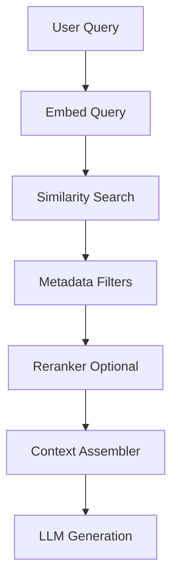
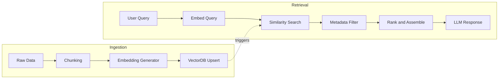

# **Designing a Multi-Tenant RAG Architecture Using Vector Databases**

## Summary

Retrieval Augmented Generation (RAG) has become a foundational pattern for modern AI-enabled SaaS platforms. It enables systems to provide accurate, context-aware responses by retrieving the most relevant information from tenant-specific data stores before invoking a language model.

This article describes a scalable, multi-tenant RAG architecture that supports vector embeddings, similarity search, ingestion pipelines, metadata filtering, and isolation across multiple scopes. The design is generic, cloud-agnostic, and reusable for any SaaS system that requires AI-driven responses based on private tenant data.

---

# **1. Introduction**

As SaaS applications adopt AI functionality, several challenges arise:

* tenant data must remain fully isolated
* vector embeddings must scale with tenant size
* ingestion pipelines must process updates efficiently
* similarity search must respect scope boundaries
* retrieval must combine structured and unstructured information
* latency must remain predictable
* costs must be manageable

Traditional full-text search cannot meet these requirements.

The solution is a **multi-tenant vector database architecture that powers tenant-isolated RAG pipelines**.

---

# **2. Architecture Overview**

A RAG system typically includes:

1. **Embedding Generator**
2. **Chunking and Normalization**
3. **Vector Index Store**
4. **Metadata Store**
5. **Similarity Search**
6. **Reranking or Filtering Layer**
7. **LLM Response Layer**

In a multi-tenant environment, each of these components must be aware of the tenant’s scope.

---

# **3. Multi-Tenant Isolation Models for VectorDB**

There are three common designs for isolating embeddings:

## **3.1 Tenant-Sep Indexes (Preferred)**

Each tenant has its own vector index.

Pros:

* strong isolation
* easiest to delete or migrate tenant data
* predictable performance per tenant

Cons:

* more indexes to manage

## **3.2 Shared Index with Metadata Filters**

A single index stores embeddings for all tenants, with metadata fields like:

```
tenant_id
scope_key
document_type
timestamp
```

Pros:

* lower operational cost
* easier to manage

Cons:

* must rely on metadata filtering to enforce isolation
* deletion and migrations are more complex

## **3.3 Hybrid (small tenants shared, large tenants isolated)**

Useful when tenant sizes vary widely.

---

# **4. Embedding Ingestion Pipeline**

### Steps:

1. **Source Data Extraction**
   Structured and unstructured data from the tenant.

2. **Chunking**
   Split large text into smaller, meaningful segments.

3. **Cleaning**
   Remove noise, normalize text, enforce consistency.

4. **Embedding Generation**
   Use a transformer model to generate vector representations.

5. **Metadata Attachment**
   Include tenant_id, scope_key, document_type, and custom tags.

6. **Upsert to VectorDB**
   Insert or update embeddings.

7. **Event Trigger**
   Publish a “VectorIndexUpdated” event for downstream consumers.

This pipeline may run:

* on data creation
* on data update
* on schedule
* on manual trigger
* using change data capture (CDC)

---

# **5. Retrieval Flow Diagram**



This flow respects the tenant boundary at each step.

---

# **6. Metadata Filtering**

Metadata plays a critical role in multi-tenant RAG.

Common filters include:

* tenant_id
* scope_key
* user access permissions
* document_type
* timestamp
* tags

Metadata filtering ensures:

* a user retrieves only the vectors they have permission to access
* no cross-tenant leakage
* efficient query narrowing
* easy deletion based on scope

---

# **7. Combining Structured and Unstructured Data**

A practical RAG architecture often merges:

* structured fields (stored in SQL)
* unstructured chunks (stored in VectorDB)

Example retrieval strategy:

1. Fetch structured records based on filters.
2. Retrieve relevant embeddings using similarity search.
3. Merge them into a unified context block.

This allows the platform to provide context that combines:

* text notes
* comments
* descriptions
* metadata fields
* relationships
* temporal information

---

# **8. Multi-Scope Retrieval Strategy**

In hierarchical systems, data is associated with different scopes.

Retrieval must respect:

* explicit permissions
* inherited permissions
* scope boundaries
* visibility rules

### Retrieval logic:

```
allowed_scopes = get_effective_scopes(user)

vectors = similarity_search(
    query_embedding,
    filter = { tenant_id, scope_key in allowed_scopes }
)
```

This ensures strict access control during AI retrieval.

---

# **9. Event-Driven Vector Updates**

Vector indexes must stay up to date as data evolves.

Examples of events:

* ItemCreated
* ItemUpdated
* DescriptionChanged
* AttachmentAdded
* CommentAdded
* MetadataModified

Handlers react to these events:

1. Fetch updated content
2. Recompute embedding
3. Upsert or delete vector
4. Publish “VectorIndexUpdated”

This keeps the RAG pipeline incremental and efficient.

---

# **10. Reranking and Scoring**

After similarity search, a reranking layer may:

* boost specific scopes
* boost recent content
* demote older content
* enforce type preferences
* apply semantic filters

Example scoring factors:

* cosine similarity
* document weight
* recency weight
* access level
* field relevance

This improves answer quality significantly.

---

# **11. Context Assembly**

The final context sent to the LLM must:

* fit token limits
* include the most relevant chunks
* maintain tenant boundaries
* reflect user permissions
* include structured data where needed

Typical strategy:

* top N results by score
* collapse redundant chunks
* join related chunks into paragraphs
* include structured key fields
* add timestamps for context

---

# **12. Multi-Tenant Cost Optimization**

Vector indexing can get expensive.
Several strategies help keep costs under control:

* generate embeddings only for changed content
* store commonly used embeddings in cache
* delete embeddings for archived items
* maintain separate indexes for heavy tenants
* compress embeddings
* batch updates
* prune unused vectors periodically

This ensures sustainable operation.

---

# **13. Tech Options for Vector Search**

Common choices:

* PostgreSQL + pgvector
* Elasticsearch vector search
* Pinecone
* Weaviate
* Qdrant
* Milvus
* OpenSearch vector engine

Your architecture remains generic regardless of vendor.

---

# **14. Example Full Architecture Diagram**



---

# **15. Final Thoughts**

A multi-tenant RAG architecture requires more than just embeddings and similarity search. It must enforce strict isolation, support dynamic updates, combine structured and unstructured data, maintain permission boundaries, and scale as tenant data grows.

This generic architecture pattern provides a foundation that any SaaS platform can use to incorporate AI-driven retrieval without compromising security, performance, or isolation.
