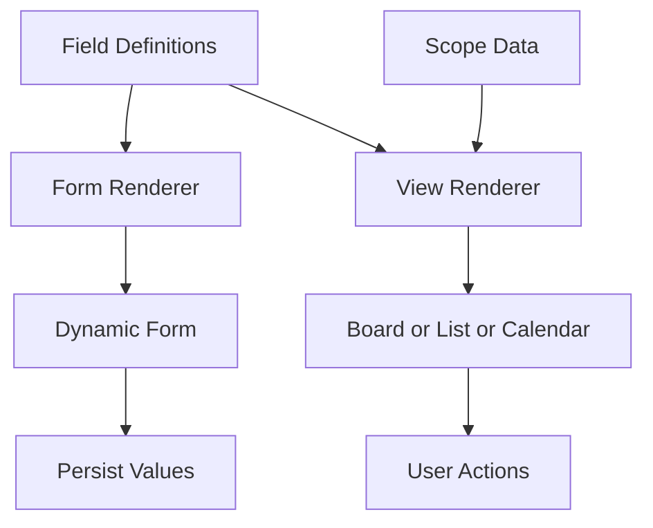

# **Designing a Dynamic Field Engine and Extensible Views Architecture for SaaS Platforms**

## Summary

Modern SaaS platforms require high flexibility. Users expect to create custom fields, modify layout, choose how data appears, and adapt the system to different workflows. A static, hardcoded approach cannot support this.

This article describes a generic architecture pattern for building a **Dynamic Field Engine** and a **View Renderer** that supports multiple presentation modes like lists, boards, calendars, and timelines. The design is fully generic and works for any multi level SaaS system, regardless of domain.

---

# **1. Introduction**

As products grow, new requirements emerge:

* More field types
* Configurable forms
* Conditional visibility
* Per scope custom fields
* Different views for the same data
* User defined layouts
* Versioned field definitions

These needs create complexity that static schemas cannot satisfy. A flexible and extensible architecture becomes essential.

The solution is a **dynamic field engine** combined with a **view renderer** that interprets metadata instead of relying on hardcoded definitions.

---

# **2. What Is a Dynamic Field Engine**

A Dynamic Field Engine is a system where:

* Fields are defined through metadata
* Field types determine behavior
* Field properties configure appearance and constraints
* Scopes can override or extend definitions
* New fields can be added without changing the database structure
* Validation rules are metadata driven

In this design, the platform stores field definitions as data rather than code.

---

# **3. Field Definition Structure**

Each field is represented by a definition record such as:

* Field key
* Field type
* Display label
* Order of appearance
* Required or optional
* Common properties (placeholder, help text, etc.)
* Specific properties based on type
* Visibility rules
* Read only flag
* Deletable flag
* Version metadata
* Field level constraints

All fields follow the same structural contract regardless of type.

---

# **4. Field Types and Their Specific Properties**

Common examples of field types include:

* Text
* Number
* Select
* Multi Select
* Date
* Boolean
* Rich Text
* File
* Icon Field
* Calculated Field
* Dynamic Display Value (system generated)

Each type has specific properties. For example:

* Select fields have option lists
* Dates may have min and max date
* Text fields have min and max length
* Rich Text has an editor config
* Display fields have a source expression

The dynamic engine uses metadata to decide behavior rather than static code paths.

---

# **5. Multi Scope Field Configuration**

A powerful capability is allowing fields to behave differently in different scopes.

Example behaviors:

* A field may be visible in one scope and hidden in another
* A field may be required at one scope but optional at a lower level
* A field may have different labels across scopes
* Some fields may be global and others local to a specific scope

Scoping rules ensure consistent flexibility across the hierarchy.

---

# **6. Rendering Dynamic Forms**

The form renderer interprets field definitions and produces a UI at runtime.

### Steps:

1. Fetch all field definitions for the current scope
2. Merge inherited definitions from parent scopes
3. Apply overrides
4. Sort by field order
5. Render form elements based on field type
6. Apply validation rules
7. Bind input values back to the engine

The UI remains consistent even when developers introduce new field types in the future.

---

# **7. Designing an Extensible Views Architecture**

A View is a way of presenting data using a template. Common views include:

* List View
* Board View
* Table View
* Calendar View
* Timeline View
* Custom user defined views

Each view uses the same underlying data but displays it differently.

### View Definition Includes:

* Visible fields
* Sorting rules
* Grouping rules
* Layout configuration
* Filters
* Conditional highlighting
* View type (list, board, etc.)

This makes the system extensible.

---

# **8. Supporting User Defined Fields and User Defined Views**

A major requirement in modern SaaS is allowing users to extend the system without developer involvement. The architecture becomes significantly more powerful when users can introduce new fields or define new views based on their workflow.

This design enables both capabilities.

## **8.1 User Defined Fields**

A user defined field is created entirely through metadata. The system does not require new code or database changes.

A user defined field includes:

* a field key
* the field type
* label and placeholder
* order
* required or optional
* validation rules
* visibility conditions
* type specific configuration
* scope of applicability

Once created, the form renderer automatically displays it because it interprets metadata rather than code. This lets different scopes have different sets of fields while still using the same engine.

## **8.2 User Defined Views**

Users may require different ways of seeing their data. One group may need a compact list view. Another may require grouped columns like a board. Another may prefer a time based view.

A user defined view stores:

* selected fields
* field order
* filters
* grouping logic
* sorting rules
* layout type
* user specific preferences

The underlying renderer works the same way regardless of whether a view was defined by the system or defined by a user. It only reads metadata and maps it to a template.

## **8.3 Advantages**

Supporting user defined fields and views provides:

* flexibility at scale
* deep customization per scope
* different workflows supported without branching code
* new use cases supported without deployments
* consistent UI based on metadata
* product evolution without structural redesign

This makes the platform behave like a low code engine where users construct their own experience while the architecture remains stable.

---

# **9. How the View Renderer Works**

The renderer receives:

* The data set
* The view configuration
* The field definitions

It then follows these steps:

1. Apply filters
2. Apply sorting rules
3. Apply grouping rules (for board like views)
4. Format each field value using the field engine
5. Map the data into the chosen layout template
6. Render the final UI

The renderer does not care about domain logic. It only processes metadata and data.

---

# **10. Example Mermaid Diagram: Dynamic Fields and Views**

---

# **11. Metadata Driven Behavior**

The biggest advantage of this architecture is that behavior evolves through metadata.

Examples:

* Add a new field type without code changes
* Add a new view type by plugging in a template
* Introduce conditional visibility using a rules engine
* Override field properties per scope
* Create new options for select fields dynamically
* Reorder fields without redeploying the system

This makes the system highly adaptable.

---

# **12. Performance Considerations**

A fully dynamic system must consider:

* Caching field definitions per scope
* Versioning definitions to avoid stale data
* Using lightweight structures for rendering
* Minimizing database lookups
* Precomputing option lists
* Materializing view level sort key values
* Using lazy load patterns for large option sets

With proper caching and precomputation, dynamic architectures perform well at scale.

---

# **13. Lessons Learned**

Key takeaways when designing a dynamic field engine:

* Treat field definitions as metadata
* Keep field types extensible
* Use common and specific property buckets
* Apply consistent ordering rules
* Support inheritance across scope layers
* Make the form renderer independent of domain logic
* Treat views as non domain specific templates
* Cache aggressively
* Use clear field keys and avoid coupling to UI labels

---

# **14. Final Thoughts**

SaaS platforms need flexibility and adaptability. A dynamic field engine and an extensible view architecture provide a scalable foundation that supports different workflows, deep customization, and future features without rearchitecting the system.

This pattern is domain neutral and fits any multi layered SaaS product that requires configurable forms and multiple views across scopes.
