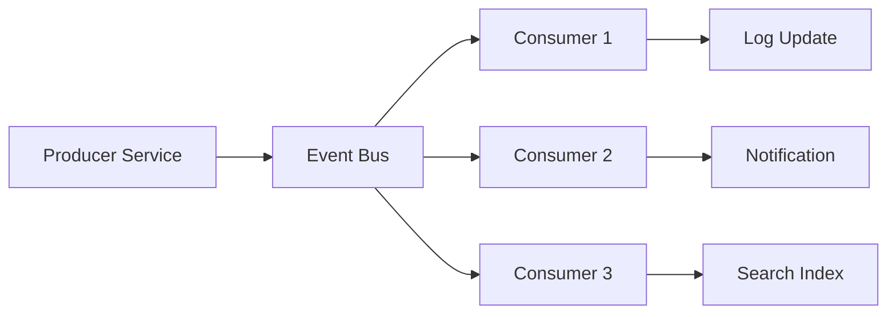
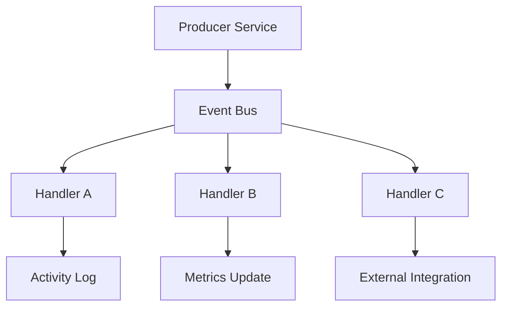

# **Designing an Event Driven Architecture for Scalable SaaS Platforms**

## Summary

As SaaS platforms grow, workflows become more complex and require decoupling to stay scalable, reliable, and extensible. Features such as notifications, activity logs, analytics, search indexing, user actions, and integrations often depend on the same core events.

This article describes a generic Event Driven Architecture (EDA) pattern that fits any multi level SaaS system. It covers domain events, system events, inheritance considerations, isolation boundaries, and best practices for building an extensible, asynchronous workflow model.

---

# **1. Introduction**

Modern SaaS systems must handle a wide range of actions:

* user actions triggering multiple downstream processes
* asynchronous workflows
* background processing
* audit requirements
* search indexing
* integration triggers
* real time notifications

Doing all of this synchronously creates tight coupling and performance bottlenecks.

Event Driven Architecture solves this by turning workflows into isolated, independent event handlers that react to a published event.

---

# **2. What Is an Event Driven Architecture**

In EDA:

* a core service produces an event
* an event bus transports it
* multiple consumers subscribe to it
* each consumer handles the event in isolation

The publisher does not know or care who handles the event.
Consumers can be added, removed, or changed without affecting the core logic.

This creates a highly decoupled system.

---

# **3. Types of Events in SaaS Platforms**

## **3.1 Domain Events**

Events that describe meaningful business actions:

* ScopeCreated
* ScopeUpdated
* ItemCreated
* ItemMoved
* FieldValueChanged
* CommentAdded

Domain events describe state changes in the system.

## **3.2 System Events**

These events support internal system behavior:

* NotificationTriggered
* SearchIndexRequired
* AuditEntryNeeded
* MetricsUpdateRequired
* PermissionRecalculation

## **3.3 Integration Events**

These support communication with third party systems:

* WebhookDelivery
* ExternalSyncStarted
* ExternalSyncCompleted

These events are safe to expose outside the platform.

---

# **4. Benefits of Event Driven Architecture**

### **4.1 Decoupling**

Code that triggers an event does not need to call other services directly.

### **4.2 Performance**

Slow or heavy tasks can run in background.

### **4.3 Extensibility**

New features can subscribe to existing events without changing core logic.

### **4.4 Reliability**

Failures in event handlers do not break user flow.

### **4.5 Parallelization**

Multiple consumers can process the same event simultaneously.

### **4.6 Reusability**

One event can feed logs, analytics, search, integrations, and automations.

---

# **5. Event Flow Structure**

Below is a generic diagram of how events flow in a SaaS platform.

The same event feeds many independent pipelines.

---

# **6. Designing the Event Bus**

A platform can use any of these technologies:

* Kafka
* RabbitMQ
* AWS SNS and SQS
* GCP PubSub
* PostgreSQL notification channels
* In memory event dispatchers for small systems

Regardless of the technology, the structure is:

* producer
* event envelope
* event bus
* consumer
* handler

---

# **7. Event Envelope Structure**

A typical event envelope contains:

* event id
* event name
* timestamp
* scope key
* actor id
* payload
* version number

The version number helps evolve the payload safely.

---

# **8. Isolation in Multi Level Scope Systems**

Events must maintain **scope boundaries**, especially in multi tenant SaaS.

Rules:

1. Every event must include the scope it belongs to
2. Consumers must validate the scope before processing
3. Cross scope processing should be explicit
4. Sensitive data should never be placed in events without encryption
5. Tenants must not see each other's events

This ensures safe handling across Root, Intermediate, and Leaf scopes.

---

# **9. Event Delivery Patterns**

## **9.1 Fire and Forget**

The producer publishes an event and returns immediately.
Useful for UI actions and low risk events.

## **9.2 Event Sourcing (Optional)**

The system stores events as the source of truth.
Advanced pattern, useful for audit heavy systems.

## **9.3 Saga Pattern**

Long running workflows spanning multiple events:

1. event triggers action A
2. action A publishes another event
3. action B finishes
4. system listens for the final event to close the workflow

## **9.4 Outbox Pattern**

Ensures reliable publishing:

* database writes event to outbox table
* background process publishes it
* prevents lost events

This is essential for strong consistency.

---

# **10. Handling Failures**

Every large SaaS system faces:

* transient failures
* slow handlers
* network interruptions
* invalid payloads

Common solutions:

* retry with backoff
* dead letter queues
* poison message detection
* idempotent handlers
* storing failed payloads for manual review

Idempotency ensures events can be retried safely.

---

# **11. Observability and Monitoring**

Monitoring an event system requires:

* event logs
* metrics for publish and consume times
* dashboards for error rates
* tracing across event flows

This helps detect slow consumers, repeated failures, and missing handlers.

---

# **12. Example Event Processing Pipeline Diagram**

This shows one event powering multiple parts of the system without direct coupling.

---

# **13. Evolving the Event Model**

The event system should grow with the platform.

Recommendations:

* version events carefully
* avoid rigid payload structures
* allow multiple consumers
* allow multiple producers
* maintain backward compatibility
* do not assume single handler per event
* use schema registry if needed

This keeps the system flexible for future requirements.

---

# **14. Final Thoughts**

Event Driven Architecture is essential for modern SaaS systems that need flexibility, performance, and decoupling. It enables a platform to grow without bottlenecks, support user initiated automations, integrate with external systems, and maintain clean boundaries across scopes.

A well designed event model helps the product scale without redesigning core workflows and makes the system resilient, extensible, and future ready.
