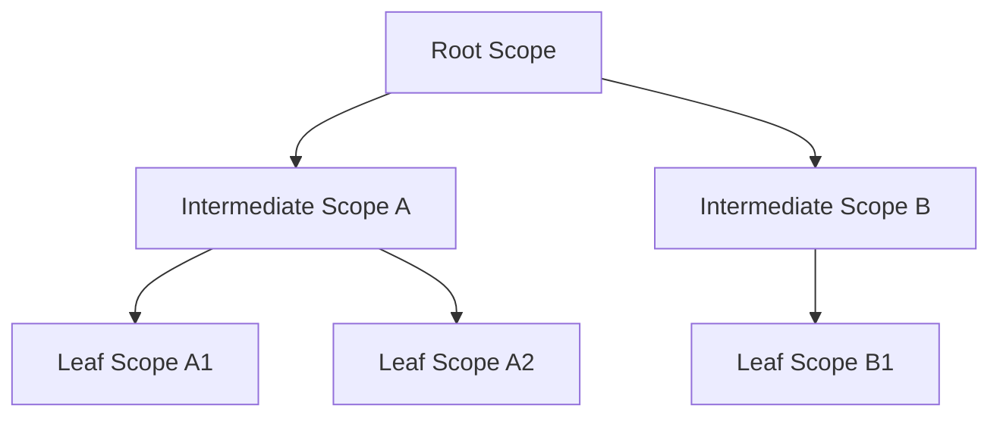
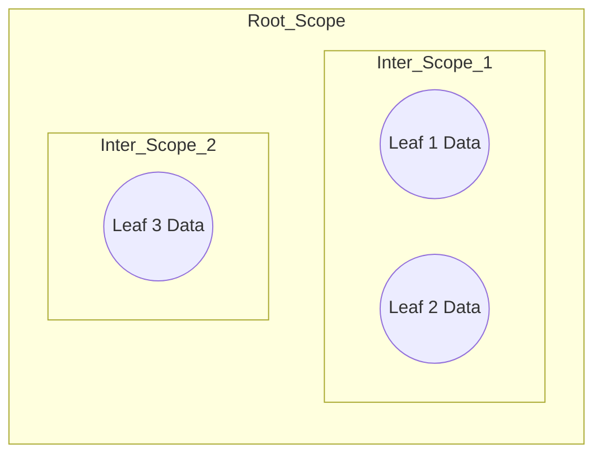

# **Designing a Multi-Tenant SaaS Platform Using Hierarchical Scopes: A Scalable Architecture Pattern**

## **Summary**

Multi-tenant SaaS platforms must isolate data, permissions, and operations across multiple customers while remaining scalable and extensible. Traditional “tenant-per-schema” or “tenant-per-column” models often fail when products grow into complex, hierarchical structures.

This article introduces a **Hierarchical Scope Architecture** using **Root**, **Intermediate**, and **Leaf** scopes - a generic, future-proof pattern suitable for any SaaS platform that requires multi-level isolation.

---

## **1. Introduction**

Most SaaS products begin with a simple tenant model, but they quickly outgrow it when:

* Sub-groups or sub-entities must exist within a tenant
* Different layers need different permissions
* Certain features apply only at certain levels
* You need to propagate settings across multiple layers
* The system needs to support *future* structural changes

This is where a **Hierarchical Scope Architecture** becomes essential.

---

## **2. What Is a “Scope”?**

A **Scope** represents a boundary of:

* Data isolation
* Permission enforcement
* Configuration
* Ownership
* Resource visibility

A Scope may contain entities, users, settings, or sub-scopes.

In this architecture, scopes are not tied to any domain. They are **abstract containers**.

### **Scope Types**

* **Root Scope** – the top-most container
* **Intermediate Scope(s)** – optional layers between the root and leaf
* **Leaf Scope(s)** – the smallest functional boundary where actionable data lives

```
Root Scope
   └── Intermediate Scope
         └── Leaf Scope
```

This hierarchy is infinitely extensible - you can introduce more layers in the future without redesigning your system.

---

## **3. Why Multi-Tenant SaaS Needs Scopes**

Most SaaS complexities are caused by:

* Multi-level structures
* Permission inheritance
* Cross-layer configuration
* Need for isolation and sharing
* Users belonging to different boundaries
* Operations that should apply only to certain sub-layers

Using scopes simplifies this by turning *every boundary* into the same building block: **a Scope**.

---

## **4. Designing the Hierarchical Scope Model**

The hierarchy follows these principles:

### **4.1. Root Scope**

The top-level tenant boundary.
All other scopes exist under this.

### **4.2. Intermediate Scopes**

Layers that model subdivisions under the tenant.
These may represent teams, departments, functional units, or any future grouping.

### **4.3. Leaf Scopes**

The lowest boundary where actual actionable items exist (tasks, files, records, etc.).

### **4.4. Scope Relationships**

* A Root Scope can have *N* Intermediate Scopes
* An Intermediate Scope can have *N* Leaf Scopes
* A Leaf Scope does not contain further subdivisions (unless expanded in the future)

You can have unlimited depth if your product evolves.

---

## **5. Multi-Schema vs Single-Schema Strategy**

This architecture works with both models:

### **5.1. Single Schema with Scope Key**

Every record carries a `scope_key` to enforce isolation.

### **5.2. Multi-Schema (Recommended for Complex Products)**

Each Root Scope receives its own schema, while Intermediate and Leaf Scopes remain inside that isolation boundary.

This prevents data leakage and simplifies encryption, scaling, and backup strategies.

---

## **6. Data Isolation & Access Boundaries**

Each scope represents a data boundary.

### **Isolation Rules**

* Data created in a Leaf Scope is visible only within its scope
* Intermediate Scopes may aggregate data from their children
* Root Scope can view/manage all subordinate scopes
* Cross-scope visibility is always explicit, never implicit

This pattern ensures predictable isolation even as the product evolves.

---

## **7. Metadata & Configuration Across Scopes**

Metadata can sit at any layer:

* Root Scope: global defaults, tenant branding, subscription limits
* Intermediate Scope: team-level rules, labels, workflows
* Leaf Scope: instance-specific data

### **Propagation Rules**

* Settings can cascade downward
* Leaf-level overrides do not affect parents
* Intermediate Scopes can override Root defaults
* Versioning ensures safe upgrades

This allows extreme flexibility without redesigning the system every time.

---

## **8. Adding New Scopes in the Future**

Because scopes are **generic**, adding new layers is straightforward:

* Add a new scope type
* Insert it between existing layers
* Define parent-child relationships
* Apply propagation rules

This is far superior to hard-coding domain-specific layers into the product.

---

## **9. Performance Considerations**

To make hierarchical scopes efficient:

* Use indexed `scope_key` fields
* Cache frequently accessed scope metadata
* Use hierarchical caching (Root → Intermediate → Leaf)
* Maintain materialized aggregates when needed
* Use bulk propagation to update child scopes
* Apply lazy loading for deep hierarchies

This ensures performance stays stable even at scale.

---

## **10. Example Architecture Diagram**

Below is a generic, safe Mermaid diagram illustrating how scopes relate.

### **Scope Hierarchy**



### **Logical Data Isolation**



---

## **11. Lessons Learned**

* Avoid domain-specific terminology in the core architecture
* Design scopes as reusable, future-proof containers
* Always enforce isolation based on scope boundaries
* Make permission models aware of scope hierarchy
* Metadata should propagate downward, not upward
* Keep the architecture composable for future expansion
* Use scopes instead of static tenant structures

This approach prevents redesigns even when your product grows unexpectedly.

---

## **12. Final Thoughts**

Hierarchical Scope Architecture is a powerful pattern for designing extensible, secure, multi-tenant SaaS platforms. By treating scopes as generic containers - instead of hardcoding domain concepts - your system gains:

* future-proof flexibility
* clean permission boundaries
* predictable data isolation
* support for complex hierarchies
* simpler onboarding of new product areas

This pattern works regardless of domain and can support systems that evolve from simple tenant models to deeply layered enterprise structures.
