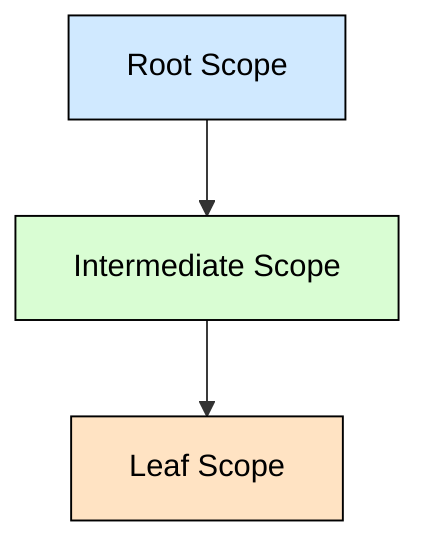
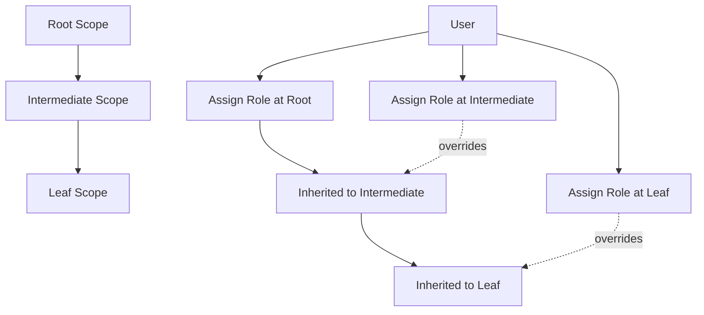

# **RBAC Scope Inheritance Model for Multi-Level SaaS Platforms**

## **Summary**

Multi-level SaaS platforms often require users to operate across multiple boundaries with different permissions. A traditional flat RBAC (Role-Based Access Control) model quickly becomes insufficient when the system introduces layered scopes such as Root, Intermediate, and Leaf levels.

This article presents a generic, future-proof **Scope-Based RBAC Inheritance Model** that supports multi-level access rules, explicit vs inherited roles, downward propagation, and controlled overrides - all without relying on any specific domain.

---

# **1. Introduction**

As SaaS products evolve, they often expand from a simple single-tenant model into more complex, layered structures. Each layer (or *scope*) may require:

* Different permissions
* Different role assignments
* Different visibility rules
* Local overrides
* Aggregated access from parent layers

A generic and scalable RBAC system must support all of these without hardcoding domain-specific logic.

The solution: **Scope-Based RBAC with inheritance**.

---

# **2. Understanding Scopes**

In this architecture, scopes represent logical access boundaries:

* **Root Scope** – top-most layer
* **Intermediate Scope(s)** – optional layers
* **Leaf Scope(s)** – lowest-level boundaries where actionable data exists

Every entity, action, or resource belongs to a scope.

---

# **3. Why Flat RBAC Fails in Layered Systems**

Traditional RBAC assigns:

* User → Role
* Role → Permissions

This works only when the system has *one level* of boundaries.

But layered SaaS systems create problems:

* Users need access to multiple scopes
* Some permissions should inherit from higher scopes
* Some should not
* Child scopes may override parent scopes
* Removing a parent role must remove inherited child roles
* Explicit roles must never be overwritten by inheritance

A flat model cannot support this.

---

# **4. Scope-Based RBAC: The Core Idea**

Instead of assigning a role *globally*, the system assigns a role **within a specific scope**.

```
User → Role → Scope
```

Every scope can grant a different role to the same user.

Inheritance allows:

* Roles assigned at the Root Scope
* To propagate down to Intermediate and Leaf scopes
* Unless explicit overrides exist

---

# **5. Role Assignment Types**

There are two types of assignments:

### **5.1. Explicit Assignment**

The user was assigned a role directly **in that scope**.

Example:

```
User A is explicitly assigned Role X in Leaf Scope.
```

### **5.2. Inherited Assignment**

The role is automatically granted because the user has a role in a parent scope.

Example:

```
User A has Role X in Root Scope → inherited into all child scopes.
```

This model supports both structured central control and granular overrides.

---

# **6. Role Propagation Rules**

To keep the system predictable, the following rules apply:

### **6.1. Rule 1 - Downward Propagation**

Roles propagate downward:

```
Root → Intermediate → Leaf
```

### **6.2. Rule 2 - Explicit Overrides Block Inheritance**

If a user is explicitly assigned in a scope, inheritance cannot override it.

### **6.3. Rule 3 - Removing Parent Role Removes Inherited Roles**

If a role is removed in a higher scope:

* All inherited roles in child scopes are removed
* Explicit child assignments remain untouched

### **6.4. Rule 4 - Adding New Child Scopes**

Whenever a new scope is created, inherited roles automatically populate it.

### **6.5. Rule 5 - Consistent Permission Sets**

Permissions come from:

* All explicit roles in that scope
* Plus inherited roles from parent scopes

---

# **7. Example Inheritance Flow**

Below is a safe, generic example using 3 levels of scopes.



### **Example User Roles**

| Scope        | Assignment Type   | Role   |
| ------------ | ----------------- | ------ |
| Root         | Explicit          | Admin  |
| Intermediate | Inherited         | Admin  |
| Leaf         | Override Explicit | Viewer |

In this scenario:

* The user gets **Admin** in Root and Intermediate
* But in the Leaf, explicit assignment forces **Viewer**
* Viewer does *not* override Admin in the parents

---

# **8. Effective Permissions Calculation**

A user’s final set of permissions in a given scope =

```
Union of:
    - Explicit roles in this scope
    - Inherited roles from all parent scopes
```

While ensuring:

```
Explicit > Inherited
```

This avoids accidental privilege escalation.

---

# **9. Preventing Circular Relationships**

Since scopes form a **tree**, not a graph:

* A Leaf cannot have its own children
* A Root cannot be a child
* No cycles can exist

This keeps inheritance predictable and computationally cheap.

---

# **10. Multi-Scope User Access**

A user may belong to multiple scopes:

```
User A:
  - Root Scope → Admin
  - Intermediate Scope → Auditor
  - Leaf Scope → Contributor
```

The system must:

* Maintain separate explicit assignments
* Compute separate inherited roles
* Merge them when calculating permissions

This is critical in layered SaaS systems.

---

## **11. Materializing Effective Permissions (Optional Optimization)**

For larger systems, computing permissions dynamically can be expensive.

Common optimizations include:

* Maintaining an **Effective Permissions Table**
* Pre-calculating permissions on role updates
* Using event-driven propagation to update children
* Caching permissions per user per scope
* Using versioning to revalidate stale permissions

This improves performance in large tenants.

---

# **12. Mermaid Diagram: Full RBAC Flow**

Here is a generic flow diagram showing inheritance logic:



---

# **13. Lessons Learned**

* In multi-layer systems, RBAC must follow the scope hierarchy
* Explicit assignments always take priority
* Inheritance enables centralized control
* Removing parent roles must update all children
* Leaf-level overrides are essential
* Materializing effective permissions improves performance
* The scope tree model future-proofs your RBAC system

---

# **14. Final Thoughts**

A Scope-Based RBAC Inheritance Model simplifies access management in complex SaaS architectures by aligning permissions with the natural hierarchy of the system. It ensures:

* Consistent behavior
* Predictable inheritance
* Flexible overrides
* High scalability
* Easy addition of new scope layers

This pattern works for any multi-layer tenant system, regardless of the product domain.
